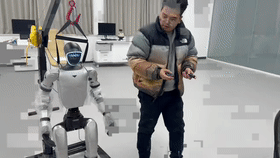

# Unitree G1 Joy-Con Teleoperation 

[](LICENSE)
[](https://www.python.org/)
[]()
[](https://www.unitree.com/)

这是一个针对 **Unitree G1 人形机器人** 的开源遥控操作项目。通过使用一对 **Nintendo Joy-Con 手柄**，您可以直观地通过逆运动学 (IK) 和体感 (IMU) 控制机器人的双臂。🇨🇳 

**核心特性：混合控制 (Hybrid Control)**
本程序允许您**使用 Python 脚本控制上半身动作，同时保留使用 Unitree 官方遥控器控制机器人行走的能力**。




## ✨ 功能特性

* **双臂 IK 控制**：使用 Joy-Con 摇杆控制手臂末端在空间中的位置。
* **6-DoF 体感映射**：利用 Joy-Con 内置的 IMU 传感器，实时映射手腕的旋转姿态 (Pitch/Roll/Yaw)。
* **腰部刚度锁定**：自动接管腰部关节 (ID 12, 13, 14)，保持其刚度，确保机器人底层运控算法能正常维持平衡和移动。
* **安全机制**：
    * **实时锁定/解锁**：通过手柄 ZL/ZR 键一键切断控制输出，手臂自动归位。
    * **平滑启动**：程序启动时自动读取当前关节状态，防止暴冲。
* **双模式支持**：
    * `g1_dual_real.py`: 真机控制模式 (基于 Unitree SDK2)。
    * `g1_dual_mujoco.py`: MuJoCo 仿真模式 (无需真机即可调试)。

## 🛠️ 硬件与软件要求

### 硬件
1.  **Unitree G1 人形机器人** (需开启运控服务)。
2.  **Nintendo Joy-Con 手柄** (左 + 右) 一对。
3.  **PC**：
    * 运行 Linux (推荐 Ubuntu 20.04/22.04)。
    * 支持蓝牙 4.0+ (用于连接手柄)。
    * 已连接至机器人的网络 (通过网线)。

### 软件依赖
* Python 3.8+
* `unitree_sdk2py` (Unitree 官方 Python SDK)
* `hidapi` (底层手柄通讯)
* `mujoco` (如果需要仿真)

## 📦 安装指南

### 1. 系统级依赖
在 Linux 终端中安装 HID API 支持：

```bash
sudo apt-get update
sudo apt-get install libhidapi-dev

```

### 2. 克隆项目

```bash
git clone [https://github.com/SpringLight-Wang/g1_teleop.git](https://github.com/SpringLight-Wang/g1_teleop.git)
cd g1_teleop

```

### 3. 安装 Python 依赖

建议使用 Conda 或 venv 创建虚拟环境。

```bash
# 创建并激活虚拟环境 (可选)
conda create -n g1_teleop python=3.8
conda activate g1_teleop

# 安装项目依赖
pip install -e .

```
### 4. 安装 Unitree SDK2 (⚠️ 重要)
由于 PIP 版本的 `unitree-sdk2` 可能缺失 `crc_amd64.so` 库文件，建议使用源码安装或检查环境：

```bash
# 如果运行报错 OSError: .../crc_amd64.so not found
pip uninstall unitree-sdk2
git clone https://github.com/unitreerobotics/unitree_sdk2_python.git
cd unitree_sdk2_python
pip3 install -e .
```
*注意：请确保您已经正确安装并配置了 `unitree_sdk2py` 环境变量。*

## 🚀 使用教程

### 0. 准备工作

* 打开电脑蓝牙，分别配对连接 Joy-Con (L) 和 Joy-Con (R)。
* 确保手柄侧面的 LED 灯停止闪烁并常亮，表示连接成功。

### 1. MuJoCo 仿真

在mujoco仿真中测试遥操作。
请先修改[g1_teleop_project/g1_dual_mujoco.py](g1_teleop_project/g1_dual_mujoco.py)第10行中的 MODEL_PATH 变量为您本地的 XML 路径

```bash

python g1_dual_mujoco.py

```

## 🎮 按键映射表

| 手柄按键 | 对应动作 | 说明 |
| --- | --- | --- |
| **左摇杆 (Stick)** | **左臂位置 (XYZ)** | 前后推=Z轴，左右推=X/Y轴 (根据视角) |
| **右摇杆 (Stick)** | **右臂位置 (XYZ)** | 同上 |
| **左手柄姿态 (IMU)** | **左手腕旋转** | 手柄的旋转直接映射到机械臂手腕 (Pitch/Roll/Yaw) |
| **右手柄姿态 (IMU)** | **右手腕旋转** | 同上 |
| **ZL 键 (左肩)** | **左臂模式切换** | 切换 **[🔒锁定/归位]** 与 **[🔓手动控制]** |
| **ZR 键 (右肩)** | **右臂模式切换** | 切换 **[🔒锁定/归位]** 与 **[🔓手动控制]** |
| **Ctrl + C** | **安全退出** | 脚本会尝试让手臂缓慢归位并释放控制权 |

### 2. 真机混合控制

该模式下，脚本控制上半身，您可以使用官方遥控器控制机器人行走。

```bash
# 语法: python g1_dual_real.py [网卡名称]
# 网卡名称通常为 eth0, enp3s0 等，请通过 ifconfig 确认连接机器人的网卡

python g1_dual_real.py eth0

```

**操作流程：**

1. **启动机器人**：确保机器人处于站立运控状态。
2. **运行脚本**：在终端运行上述命令。
3. **等待初始化**：终端显示 `✅ 连接成功！` 且 `SDK: ON`。此时手臂处于锁定归位状态。
4. **解锁控制**：
* 按下 **左手柄 ZL** -> 解锁左臂。
* 按下 **右手柄 ZR** -> 解锁右臂。
5. **移动机器人**：此时您可以一边挥动手臂，一边用官方遥控器让机器人走路。

## 📂 项目结构

```text
g1_teleop/
├── g1_dual_real.py        # [主程序] 真机混合控制脚本
├── g1_dual_mujoco.py      # [主程序] MuJoCo 仿真脚本
├── joycon_driver_dual.py  # Joy-Con 双手柄逻辑封装
├── joyconrobotics/        # 包含 hidapi 通讯与 IMU 姿态解算的底层库
├── unitree_description/   # 机器人 URDF/MJCF 模型文件
├── setup.py               # 安装配置文件
└── README.md              # 说明文档

```

## ⚠️ 常见问题与注意事项

1. **机器人无法移动？**
* 请确保 `g1_dual_real.py` 中 `JOINT_MAP` 包含了 `waist` (ID 12, 13, 14)，并且代码正确读取了初始状态。如果腰部没有刚度（Mode 0），机器人出于保护机制会禁止下半身移动。


2. **手柄连接报错？**
* 请检查是否安装了 `libhidapi-dev`。
* 尝试在系统蓝牙设置中删除设备并重新配对。
* 确保有读取 `/dev/hidraw*` 的权限 (可能需要 `sudo` 或配置 udev rules)。


3. **手臂抖动？**
* 可能是 Joy-Con 蓝牙信号干扰。尝试将 Joy-Con 靠近电脑接收器。
* 可以在 `joycon_driver_dual.py` 中调整死区 (DEADZONE) 或滤波参数。

## ⚠️ 免责声明

* 本项目属于实验性质代码。
* **Sim2Real 存在风险**：请务必使用吊架保护机器人，或确保周围有足够的安全缓冲空间。
* 作者不对因使用本项目代码导致的任何硬件损坏或人身伤害负责。请小心操作！

## 🤝 贡献与致谢

* 感谢 **Unitree Robotics** 提供的 G1 机器人及 SDK 支持。
* Joy-Con 驱动逻辑参考了 `joycon-python` 及社区开源实现。

欢迎提交 Issue 和 Pull Request！

## 📄 许可证

本项目基于 [MIT License](https://www.google.com/search?q=LICENSE) 开源。
在使用本项目控制真机时，请务必注意安全，开发者不对因操作失误导致的硬件损坏负责。

---

*Created by [ Wang chunguang - Henan University of Technology 🇨🇳 ]*

